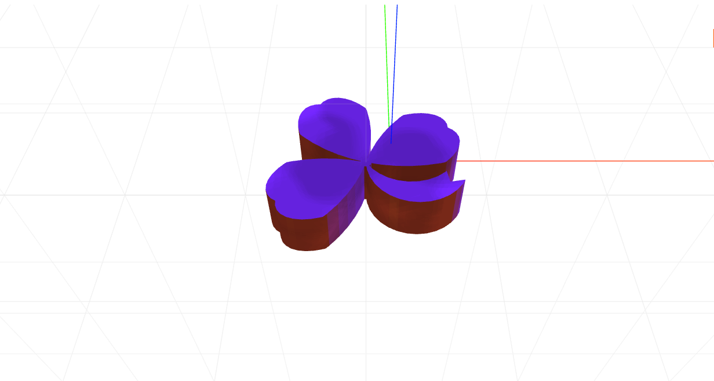

# craft-cloverleaf

# Install
```sh
$ npm install craft-cloverleaf-dragosh
```

# Parameters
```sh
numberOfLeaves - determines the number of leaves.
```

# Example
```html
<craft>
	<craft name="clover" module="craft-cloverleaf-dragosh"/>
	<clover numberOfLeaves="2"></clover>
</craft>
```

